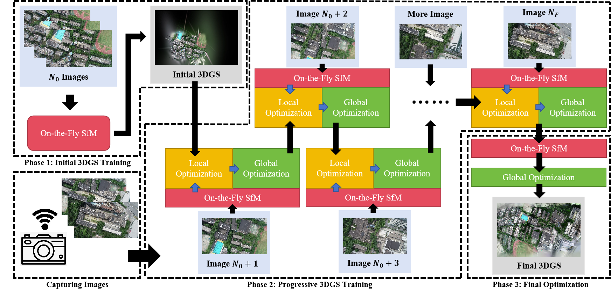

# Gaussian On-The-Fly Splatting: A Progressive Framework for Robust Near Real-Time 3DGS Optimization
Yiwei Xu, Yifei Yu, Wentian Gan, Tengfei Wang, Zongqian Zhan, Hao Cheng and Xin Wang

[](https://arxiv.org/abs/2503.13086)
[](https://xywjohn.github.io/GS_On-the-Fly.github.io/)



## Cloning the Repository

```shell
# SSH
git clone git@github.com:xywjohn/GS_On-The-Fly.git --recursive
```
or
```shell
# HTTPS
git clone https://github.com/xywjohn/GS_On-The-Fly --recursive
```

After that, please manually decompress the diff-gaussian-rasterization.zip archive located under the submodules directory.

## Setup

```shell
conda env create --file environment.yml
conda activate On_The_Fly_GS
cd .../GS_On-The-Fly

pip install pytorch3d
pip install open3d
```

## Data Preparation
Since this project aims to enable simultaneous image acquisition and 3D Gaussian Splatting (3DGS) training, we need to utilize the [On-The-Fly SfM](https://github.com/RayShark0605/On_the_fly_SfM) system proposed by Zhan et al. This system has already achieved the capability of near real-time image acquisition and camera pose estimation. In this project, we will leverage the camera poses and sparse point clouds provided by this system as the input for subsequent 3DGS training.

You can use your own data or the test data provided by us (demo_data/data1 and On-The-Fly/data1) to perform processing with the On-The-Fly SfM system. You can download our data [here](https://drive.google.com/drive/folders/1X3KiQR_bva6nUXQEznZqgHbkam91kCVB?usp=drive_link) and place all the data into the folder with the same name in this project directory. Next, please configure the parameters ```DatasetName```, ```SourceImageDataset```, and ```On_The_Fly_Dataset``` in the ```DatasetPrepare.py``` to the corresponding dataset names or paths. For example, if you intend to use the dataset provided by us directly, please set them as follows:

```shell
DatasetName = ['data1']
SourceImageDataset = r".../demo_data"
On_The_Fly_Dataset = r".../On-The-Fly" # where you save On-The-Fly SfM Results
```

This will produce results as illustrated below:

*****************************************

.../On-The-Fly/data1  
=>16  
||===>images  
||===||===>10002.jpg  
||===||===>10005.jpg  
||===||===>......  
||===>sparse  
||===||===>0  
||=========||===>cameras.bin  
||=========||===>imageMatchMatrix.txt  
||=========||===>images.bin  
||=========||===>imagesNames.txt  
||=========||===>points3D.bin  
=>17  
||===>images  
||===||===>10002.jpg  
||===||===>10005.jpg  
||===||===>......  
||===>sparse  
||===||===>0   
||=========||===>cameras.bin  
||=========||===>imageMatchMatrix.txt  
||=========||===>images.bin  
||=========||===>imagesNames.txt  
||=========||===>points3D.bin  
=>18  
||  ......  
=>19  
||  ......  
=>20  
||  ......  
=>21  
||  ......  

......

*****************************************

## 3DGS Train

```Source_Path_Dir``` should specify the directory that contains all image data, camera pose information, and sparse point cloud. ```Model_Path_Dir``` should specify the output directory for the 3DGS results. The output frequency of 3DGS can be configured by using different command-line arguments.

```shell
python ContinuosProgressiveTrain.py --Source_Path_Dir .../On-The-Fly/data1 --Model_Path_Dir .../OutputDir --FinalOptimizationIterations 4000
```

<details>
<summary><span style="font-weight: bold;">Command Line Arguments for ContinuosProgressiveTrain.py</span></summary>

  #### --Source_Path_Dir
  Path to the source directory containing all image data, camera pose information, and sparse point cloud.
  #### --Model_Path_Dir 
  Path where the trained model should be stored.
  #### --IterationFirstScene
  Training iterations for initial training phase.
  #### --IterationPerMergeScene
  Training iterations for progressive training phase. This parameter is used to control the number of 3DGS training iterations to be performed each time a new image is acquired.
  #### --MergeScene_Densification_Interval
  This parameter is used to control how often Gaussian densification is performed during the progressive training phase, based on the number of 3DGS training iterations.
  #### --FinalOptimizationIterations
  Training iterations for final refinement phase.
  #### --ProgressiveModelOutput
  Save gaussians before a new image is acquired.

</details>

## BibTeX
```
@misc{xu2025gaussianontheflysplattingprogressive,
      title={Gaussian On-the-Fly Splatting: A Progressive Framework for Robust Near Real-Time 3DGS Optimization}, 
      author={Yiwei Xu and Yifei Yu and Wentian Gan and Tengfei Wang and Zongqian Zhan and Hao Cheng and Xin Wang},
      year={2025},
      eprint={2503.13086},
      archivePrefix={arXiv},
      primaryClass={cs.CV},
      url={https://arxiv.org/abs/2503.13086}, 
}
```
